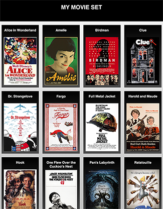
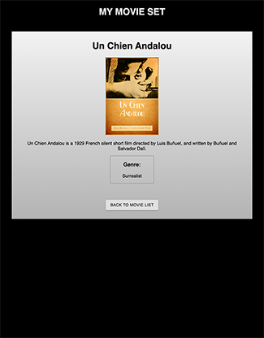

# MY MOVIE SET

## Description

Duration: weekend project.

This app displays the titles and posters of a set of movies contained in a database. When a movie's poster is clicked, the user is taken to a details page where they see not only the title and poster, but also a description and genre(s).

## Screenshots

# Prerequisites

Node, React, Postgres

## Installation

1. Create a database using the instructions and data in database.sql. (Postgres required, Postico recommended.)
2. Open your code editor of choice and run `npm install`
3. Run `npm run server` in your terminal.
4. Run `npm run client` in your terminal.  This will open a browser tab for you!

## Usage

Click any movie poster to be taken to a view of its details. On that page, a button at the bottom will bring you back to the main list.

## Built With

VSCode, JavaScript, HTML, CSS, React, PostgreSQL, Postico

## Contributors
Krystal Frost — [librarykrystal](https://github.com/librarykrystal)

## Acknowledgments
Thanks to Prime Digital Academy, and to surrealist filmmakers.